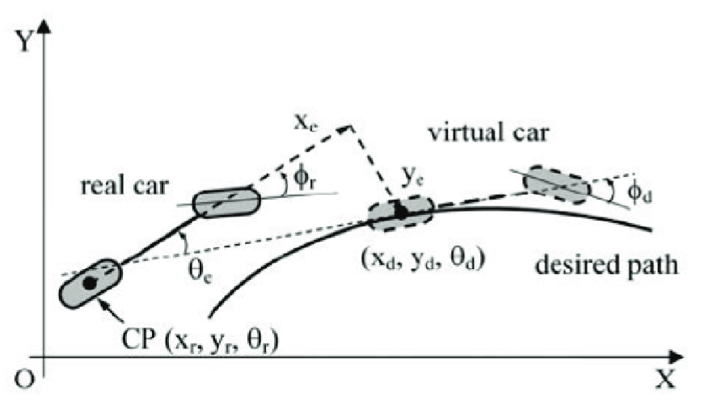

# Comparing Non-Linear Trajectory Following Controllers (Non-Linear Traditional Controllers vs. Reinforcement Learning)

## Introduction

Autonomous driving has gained significant popularity in recent years. This trend has underscored the need for comprehensive control methods. In this project, I will be comparing and contrasting several nonlinear control for an autonomous vehicle to track time-varying trajectories. The control techniques I will be comparing are of two varieties of controllers traditional nonlinear controllers and reinforcement learing based controllers.

## Dynamics of the Vehicle

For the purposes of this project, the dynamics of the vehicle are modeled as a simple kinematic bicycle model. The state of the vehicle is defined as follows:

```math

state = \begin{bmatrix} x \\ y \\ \theta \end{bmatrix}

```

The dynamics of the vehicle are defined as follows:

```math

 \begin{cases} \dot{x}_{r}=v_{r}\cos(\theta_{r})\\ 
 \dot{y}_{r}=v_{r}\sin(\theta_{r})\\ 
 \dot{\theta}_{r}=\frac{v_{r}}{l}\tan(\phi_{r}) \end{cases}
```

Where `v_r` is the velocity of the vehicle, `l` is the length of the vehicle, and `phi_r` is the steering angle of the vehicle. The inputs into this system are the velocity of the vehicle and the steering angle of the vehicle. A trajectory can be thought of as a series of waypoints that an ideal vehicle is following. Each of these waypoints has a desired position, $(x_d, y_d)$, and a desired orientation, $\theta_d$. These waypoints are the desired trajectory that the vehicle must follow.

An example of the true and desired vehicles for following a single waypoint is shown below:



## Traditional Nonlinear Controllers

Two types of nonliner controllers are implemented in this project. The first controller is a lypunov based controller and the second controller is a feedback linearization controller.

### Error Dynamics

The control objective is to have the controlled vehicle follow a path by defined by a series of way-points. From a control perspective, the controller wants to drive the difference in the real and the virtual vehicles' position and orientation to zero for each way-point. Both tradition controllers are derived from the error dynamics of the vehicle following a waypoint.

To derive these controllers the error dynamics for a vehicle following a waypoint must be defined. The error is the difference between the real vehicle position and this virtual vehicle. This error model is defined to be in the frame which is orthogonal to the path pane.

```math
\begin{bmatrix} 
x_{e}\\ 
y_{e}\\ 
\theta_{e} 
\end{bmatrix}=
\begin{bmatrix} 
\cos\theta_{d} & \sin\theta_{d} & 0\\ 
-\sin\theta_{d} & \cos\theta_{d} & 0\\ 
0 & 0 & 1 
\end{bmatrix}
\begin{bmatrix} 
x_{r}-x_{d}\\ 
y_{r}-y_{d}\\ 
\theta_{r}-\theta_{d} 
\end{bmatrix} 
```

The dynamics of this error model can be expressed as

```math
\begin{cases} 
\dot{x}_{e}=v_{r}+\omega_{r}y_{e}-v_{d}\cos(\theta_{e})\\ 
\dot{y}_{e}=-\omega_{r}x_{e}+v_{d}\sin(\theta_{e})\\
\dot{\theta}_{e}=\omega_{r}-\omega_{d} 
\end{cases} 
```

Where

```math
\omega_r = \dot{\theta_r} 
```

and

```math
\omega_d = \dot{\theta_d} 
```

### Lyapunov Based Controller

The candidate Lyapunov function is given to by [1] is given as the following.

```math
V = \frac{1}{2}x_e^2 + \frac{1}{2}y_e^2 + \frac{1}{2}\theta_e^2
```

[1] purposes that the control input of

```math
\begin{bmatrix}
    v_r\\
    \omega_r
\end{bmatrix} = \begin{bmatrix}
    v_d \cos(\theta_e - k_1 x_e)\\
    \omega_d - k_2 v_d \frac{\sin(\theta_e)}{\theta_e} - k_3 \theta_e
\end{bmatrix}
```

which claims that this results in the derivative of the Lyapunov function results in

```math
\dot{V} = - k_1 k_2x_e^2 - k_3 \theta_e^2 \leq 0
```

which is negative semi-definite so LaSalle's invariance principle must be investigated to ensure asymptotic convergence. Plugging in \( x_e = \theta_e = 0 \) into the error dynamics in \eqref{eq:error_model} results in

```math
\dot{x}_{e}=v_{r}+\omega_{r}y_{e} = 0
```

since \( v_{r} \) is time-varying and should converge to \( v_d \) is not zero this means that La'Salles does not apply and this control is not valid. This was verified in simulation as this control law immediately destabilized. To verify that there was not a typo in \eqref{eq:bad_control} I attempted to re-derive the control law from \eqref{eq:lyap}.

```math
\begin{aligned}
\dot{V} &= x_e(v_r + \omega_r y_e - v_d\cos(\theta_e)) + y_e(-\omega_r x_e + v_d \sin(\theta_e)) + \theta_e(\omega_r - \omega_d) \\
&= v_rx_e + \omega_r\theta_e -v_d\cos(\theta_e)x_e + v_d\sin(\theta_e)y_e - \theta_e\omega_d \\
&\leq v_rx_e + \omega_r\theta_e +v_d(\sin(\theta_e)y_e - x_e) - \theta_e\omega_d \\
\omega_r &\triangleq \bar{\omega_r} - \omega_d \\
&\leq v_rx_e + \bar{\omega_r}\theta_e +v_d(\sin(\theta_e)y_e - x_e) \\
v_r &\triangleq  v_d - k_1 x_e \\
&\leq -k_1x_e^2 + \bar{\omega_r}\theta_e +v_dy_e\sin(\theta_e) \\
\bar{\omega_r}&\triangleq  \frac{v_d y_e \sin(\theta_e)}{\theta_e} - k_2 \theta_e \\
&\leq -k_1x_e^2 -k_2\theta_e^2
\end{aligned}
```

This returns a similar form to \eqref{eq:bad_control} but is still negative definite and does not converge. Since the controller purposed in [1] could not result in a stabilizing controller a new Lyapunov function was found in the survey paper [2].

```math
V = \frac{1}{2}(x_e^2+y_e^2) + \frac{1-\cos(\theta_e)}{k_2}
```

With equation \eqref{eq:lyap2} [2] purposes the following control

```math
\begin{bmatrix}
    v_r\\
    \omega_r
\end{bmatrix} = \begin{bmatrix}
    k_1 x_e + v_d \cos(\theta_e)\\
    \omega_d + v_r(k_2 y_3 + k_3 \sin(\theta_e))
\end{bmatrix}
```

To verify the stability of this controller the derivative of \eqref{eq:lyap2} must be evaluated. The analysis and proof of stability was found in [3].

```math
\begin{aligned}
\dot{V} &= \dot{x}x_e + \dot{y}y_e + \dot{\theta_e}\frac{\sin(\theta_e)}{k_2} \\
&= [(\omega_r + v_r(k_2y_e + k_3 \sin(\theta_e)))y_e - k_1x_e]x_e \\
&\quad + [-(\omega_r + v_r(k_2y_e + k_r \sin(\theta_e))x_e + v_r \sin(\theta_e)]y_e \\
&\quad + [-v_r(k_2 y_e + k_3 \sin(\theta_e)]\frac{\sin(\theta_e)}{k_2} \\
&= -k_1 x_e^2 - v_r k_3 \frac{\sin^2(\theta_e)}{k_2} \leq 0
\end{aligned}
```

This again is negative semi-definite so a proof must be performed to guarantee that the error model \eqref{eq:error_model} will truly converge to zero. To demonstrate this, [3] claims that the error will converge to zero under certain assumptions. This is achieved by incorporating the control law \eqref{eq:lyap_control_law} into the error dynamics \eqref{eq:error_model}.

```math
\dot{p_e} =\begin{bmatrix}
(\omega_r + v_r(k_2 y_e + k_3 \sin(\theta_e))y_e - k_1 x_2\\
-(\omega_{r}+v_r(k_2 y_e + k_3 \sin(\theta_e))x_e + v_r \sin(\theta_e)\\
-v_r(k_2 y_e + k_3 \sin(\theta_e)
\end{bmatrix}
```

With \eqref{eq:error_control} defined [3] purposes the following.

_Proposition_ Assume that \( v_r \) and \( \omega_r \) are continuous, \( v_r, \,\omega_r, \,k_1,\, k_3 \) are bounded and \( \dot{v_r} \) and \( \dot{\omega}_r \) are sufficiently small. Under these conditions, the error is uniformly asymptotically stable over the interval \( [0,\infty) \)

_Proof:_ First \eqref{eq:error_control} is linearized around 0 which results in the dynamics of \( \dot{p}_e = Ap_e \) where

```math
A = \begin{bmatrix}

    -k_1 & \omega_r & 0 \\ -\omega_r & 0 & v_r \\ 0 &-v_r k_2 &-v_r k_3
\end{bmatrix}
```

this derivative is continually differentiable and bounded. The characteristic equation for A is

```math
a_3 s^3 + a_2 s^2 + a_1s + a_0 = 0
```

where

```math
a_3 = 1, \, a_2 = k_3 vr + k_1, \, a_1 = k_2 v_r^2 + k_1 k_3 v_r + \omega_r^2, \, a_0 = k_1 k_2 v_r^2 + \omega_r^2 k_3 v_r
```

. Since all the coefficients are positive and

```math
 a_1 a_2 - a_0 a_3 > 0
 ```

 , the real parts of all roots are negative through the Routh-Hurwitz Criterion. So by Corollary 41 on page 223 in [4], the proposition is true.

## Feedback Linearization Controller

 \cite{linearization} introduces the feedback linearized controller for this formulation of \eqref{eq:error_model}. The Ackerman steering system has something known as non-holonomic constraints which are non-integrable constraints. In this case, the constraint is that it cannot move orthogonal to its current position. Instead of controlling the back wheels which is the original control point the control point is set some distance ahead. This point $(x_g,y_g)$ is positioned $\frac{l}{2}$ distance away from the original control point. It should be noted that because the control point is placed in front of the vehicle the control is only stable when the vehicle has a positive linear velocity. If it is moving backward the control will destabilize. With this point defined the dynamics around this point can be expressed.

```math
\begin{aligned}
x_g &= x_r + \frac{l}{2}\cos(\theta_r) \\
y_g &= y_r + \frac{l}{2}\sin(\theta_r) \\
\dot{x_g} &= v\cos (\theta_r)-\dot{\theta_r}\frac{l}{2}\sin(\theta_r) \\
\dot{y_g} &= v\sin(\theta_r)+\dot{\theta_r}\frac{l}{2}\cos(\theta_r)
\end{aligned}
```

```math
\begin{bmatrix}
\dot{x}_{g} \\
\dot{y}_{g}
\end{bmatrix} = \begin{bmatrix}
\cos(\theta_r) & -\frac{L}{2}\sin(\theta_r) \\
\sin(\theta_r) & \frac{L}{2}\cos(\theta_r)
\end{bmatrix}\begin{bmatrix}
v_r \\
\dot{\theta}
\end{bmatrix} = A\left[\begin{array}{l}
v \\
\dot{\theta}
\end{array}\right]
```

With this expression of the dynamics, the control can be solved by left multiplying \eqref{eq:feedback_dyn} by the inverse of A.

\begin{equation}
\label{eq:control_lin_1}
\begin{bmatrix}
v_r \\
\dot{\theta_r}
\end{bmatrix} = \begin{bmatrix}
\cos(\theta_r) & \sin(\theta_r) \\
-\frac{2}{L}\sin(\theta_r) & \frac{2}{L}\cos(\theta_r)
\end{bmatrix}\begin{bmatrix}
\dot{x}_g \\
\dot{y}_g
\end{bmatrix}
\end{equation}

The point, $(x_g, y_g)$, can be express its position relative to the desired point, $(x_d, y_d)$, instead of the current vehicle coordinates, $(x_r, y_r)$. This results in the error dynamics defined as the following.

```math
\begin{aligned}
\dot{x}_e &= \dot{x}_d + k_1 x_e \\
\dot{y}_e &= \dot{y}_d + k_2 y_e \\
x_e &= x_d - x_g \\
y_e &= y_d - y_g
\end{aligned}
```

Substituting \eqref{eq:xg} and \eqref{eq:yg} into \eqref{eq:control_lin_1} yields the following

\begin{equation}
\begin{bmatrix}
v_r \\
\dot{\theta_r}
\end{bmatrix} = \begin{bmatrix}
\cos(\theta_r) & \sin(\theta_r) \\
-\frac{2}{l}\sin(\theta_r) & \frac{2}{l}\cos(\theta_r)
\end{bmatrix}\begin{bmatrix}
\dot{x}_d + k_1 x_e \\
\dot{y}_d + k_2 y_e
\end{bmatrix}
\end{equation}

where \( k_1 \) and \( k_2 \) are the control gains. With the control defined stability must be verified. Substituting \eqref{eq:xg} and \eqref{eq:yg} into \eqref{eq:x_e} and \eqref{eq:y_e} results in

```math
\left[\begin{array}{l} \dot{x}_{e}\\\dot{y}_{e} \end{array}\right]+\left[\begin{array}{ll} k_{1} & 0\\0 & k_{2} \end{array}\right]\left[\begin{array}{l} x_{e}\\y_{e} \end{array}\right]=0
```

implies that the derivative of, \( e = \begin{bmatrix}
x_e\\y_e
\end{bmatrix} \), is equal to itself times the negative control gains. Defining the candidate Lyapunov function to be \( V=.5e^Te \) the derivative can be taken.

```math
\begin{equation}
\label{eq:error_lyap}
\dot{V} = e^T\dot{e} = k_1x_e^2-k_2x_e^2 < 0
\end{equation}
```

\eqref{eq:error_lyap} is negative definite ensuring that the error will converge to zero.

## References

1. Alcalá, E., Sellart, L., Puig, V., Quevedo, J., Saludes, J., Vázquez, D., & López, A. (2016). Comparison of two non-linear model-based control strategies for autonomous vehicles. In _2016 24th Mediterranean Conference on Control and Automation (MED)_ (pp. 846-851). IEEE. <https://doi.org/10.1109/MED.2016.7535921>

2. Rokonuzzaman, M., Mohajer, N., Nahavandi, S., & Mohamed, S. (2021). Review and performance evaluation of path tracking controllers of autonomous vehicles. _IET Intelligent Transport Systems_, 15(5), 646-670. <https://doi.org/10.1049/itr2.12051>

3. Kanayama, Y., Kimura, Y., Miyazaki, F., & Noguchi, T. (1990). A stable tracking control method for an autonomous mobile robot. In _Proceedings, IEEE International Conference on Robotics and Automation_ (Vol. 1, pp. 384-389). IEEE. <https://doi.org/10.1109/ROBOT.1990.126006>

4. Vidyasagar, M. (2002). _Nonlinear Systems Analysis_. SIAM.

5. Solea, R., & Nunes, U. (2006). Trajectory Planning with Velocity Planner for Fully-Automated Passenger Vehicles. In _2006 IEEE Intelligent Transportation Systems Conference_ (pp. 474-480). IEEE. <https://doi.org/10.1109/ITSC.2006.1706786>

6. The MathWorks Inc. (2022). _MATLAB and Automated Driving Toolbox (R2024a)_. Natick, Massachusetts, United States. <https://www.mathworks.com/help/driving/ref/drivingscenariodesigner-app.html>

7. Bacha, S., Ayad, M. Y., Saadi, R., Kraa, O., Aboubou, A., & Hammoudi, M.Y. (2018). Autonomous Vehicle Path Tracking Using Nonlinear Steering Control and Input-Output State Feedback Linearization. In _2018 International Conference on Electrical Sciences and Technologies in Maghreb (CISTEM)_ (pp. 1-6). IEEE. <https://doi.org/10.1109/CISTEM.2018.8613365>
